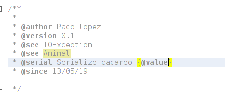
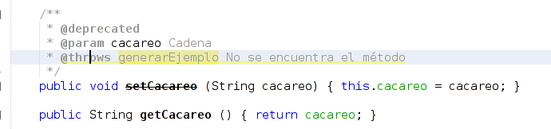
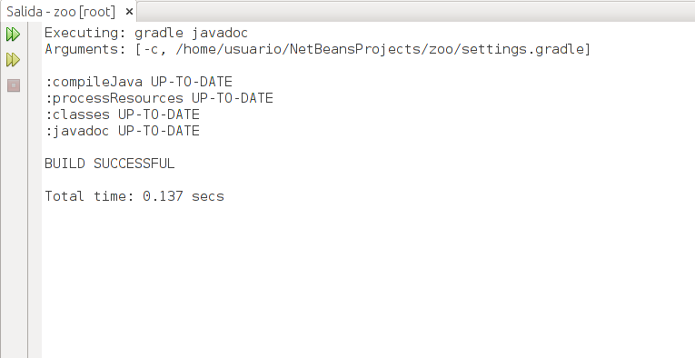
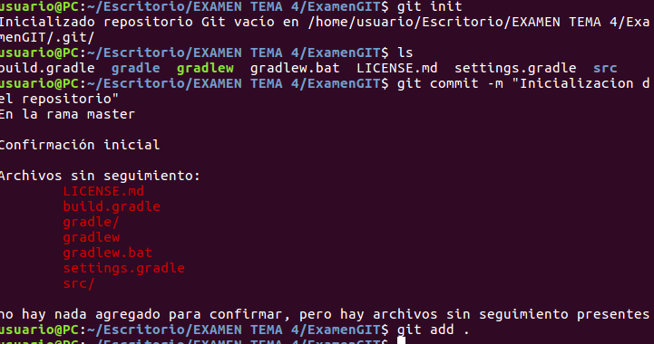
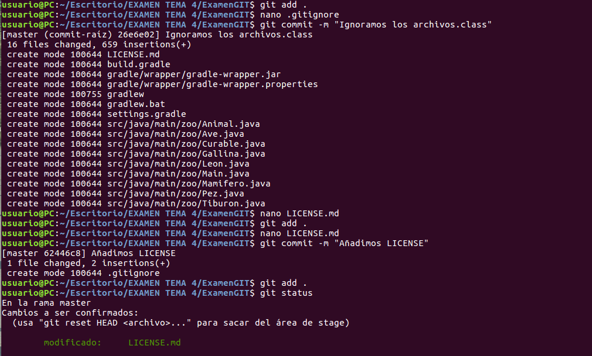
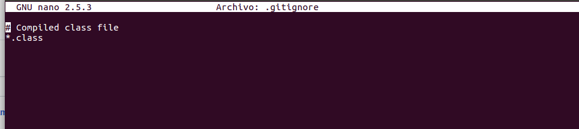
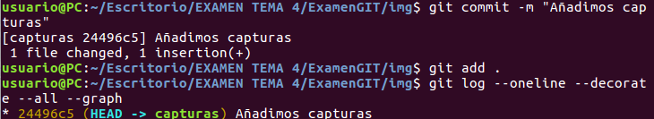
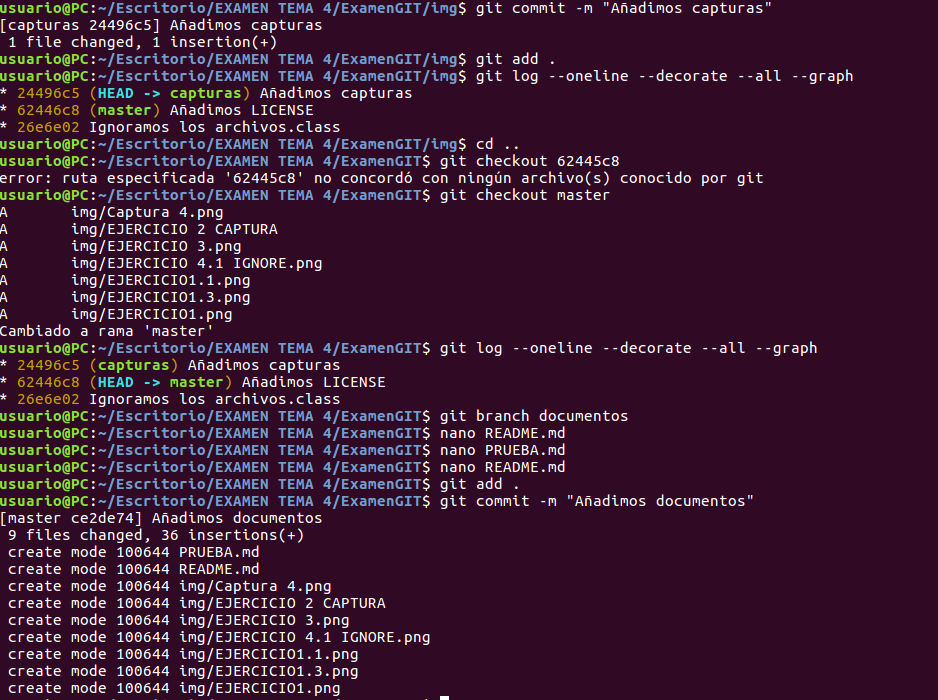

# PRUEBA DE DOCUMENTACIÓN
# OPTIMIZACIÓN
# CONTROL DE VERSIONES   

***Francisco de Asís López Chaparro***  
*13/05/2019*  

## EJERCICIO 1

## EJERCICIO 2

## EJERCICIO 3

## EJERCICIO 4

## EJERCICIO 5

## EJERCICIO 6

